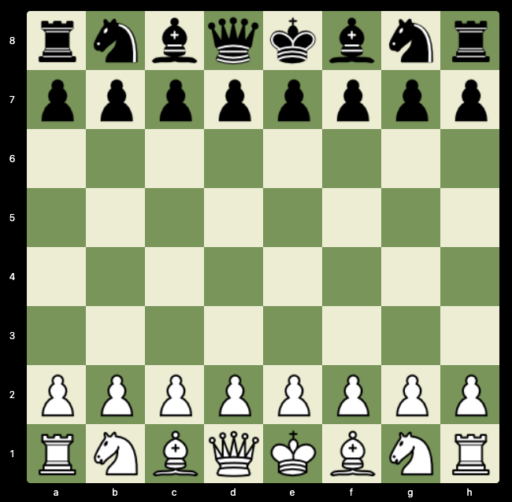

# Chess TypeScript Project

This is a Chess project implemented in TypeScript. It includes move validator functions to validate legal chess moves.



## Getting Started

To get started with this project, follow these steps:

- Clone the repository to your local machine:

  ```bash
  git clone https://github.com/barrymun/chess.git
  ```

- Create a `server/.env/` file and include the following:

  ```bash
  CORS_ORIGIN="http://localhost:3000"
  ```

  Create a `client/.env.development` file and include the following:
  ```bash
  REACT_APP_API_URL="http://localhost:3001"
  ```

  If you want to build the client code you will need a `client/.env.production` file.

- Navigate to the project directory:

  ```bash
  cd chess
  ```

- Build the common module:

  ```bash
  yarn workspace common build
  ```

- Install the required dependencies:

  ```bash
  yarn install
  ```

- Start the Express.js server with Docker:

  ```bash
  yarn docker-up
  ```

  Alternatively the express.js server can be started without using Docker:

  ```bash
  yarn workspace server build
  yarn workspace server start
  ```

- Start the react development server:

  ```bash
  yarn workspace client start
  ```

- Open your web browser and visit `http://localhost:3000`.

## Move Validator Functions

The project includes TypeScript functions to validate chess moves. These functions can be found in `common/src/move-validator.ts`. You can use these functions to ensure that the moves made in the game adhere to the rules of chess.

## Testing

`jest` (specifically `ts-jest`) is used for testing. Most of the tests can be found in the `common` package. Run the following command from the root directory:

```bash
yarn test
```

## Contributing

If you'd like to contribute to this project, feel free to fork the repository and submit a pull request with your changes. Make sure to follow the coding standards and conventions used in the project.

## License

This Chess TypeScript project is licensed under the MIT License. See the [LICENSE](LICENSE) file for details.

## TODO

- [x] check if king is in check
- [x] check if there is a checkmate or stalemate (similar logic) (sample stalemate: https://www.chess.com/forum/view/more-puzzles/stalemate-in-10-moves)
- [x] pawn promotion logic
- [x] castling logic
- [x] highlight areas on piece grab that the selected piece can move to (legal moves dots)
- [x] add `break;` statements in the direction loop checks to exit early
- [x] add `break;` statement from queen moves early if diagonal checked and move is diagonal as there would be no need to then check the straight moves
- [x] problem with rook move logic - can move from g5 to a4
- [x] show where the last piece was moved from and to with colours?
- [ ] have the game run through many sample games in the chess db
- [ ] integrate the stockfish JS engine or something along these lines: https://github.com/nmrugg/stockfish.js
- [ ] preserve the game state before a reload (singleplayer)
- [x] multiplayer (websockets & redis)
- [ ] add usernames to multiplayer and specific player matching other than random matching
- [ ] make the legal dots optional (player can toggle this setting on and off)
- [ ] lots of test cases
- [x] game over (reason, winner, etc.) modal
- [ ] add sound effects
- [ ] different colour themes for different boards and pieces
- [x] show all of the moves made so far
- [x] show moves made so far as algebraic notation
- [ ] validate the chess board to prevent cheating (based on the moves made so far?)
- [ ] show the pieces that have been captured
- [ ] show the value of the pieces that have been captured
- [x] fix min width settings to use % rather than the set amount of 100px (mobile)
- [ ] timed moves (will be added as part of a separate game mode)
- [x] fix `move-history` component min width to prevent "jumping" issue
- [x] fix grab piece issue where the "image" itself is "grabbed" (desktop)
- [x] disable right click on piece grab
- [x] change favicon and title
- [ ] fix move history text for promoted pawns
- [ ] check to see if the user has deleted their playerId from localStorage?
- [ ] make previous games viewable
